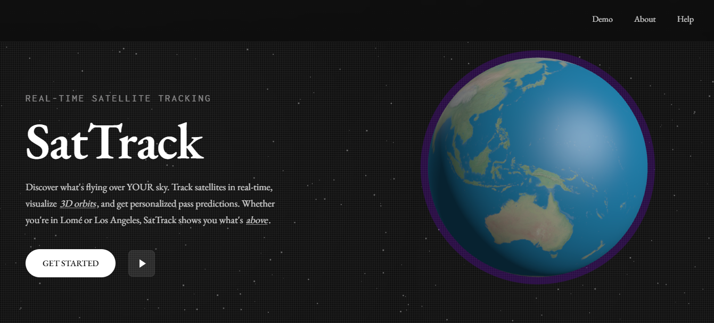
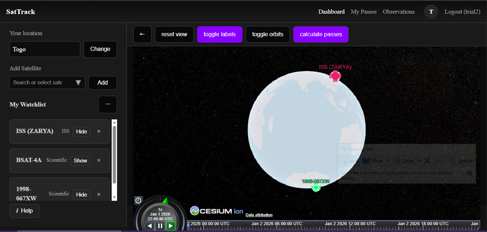
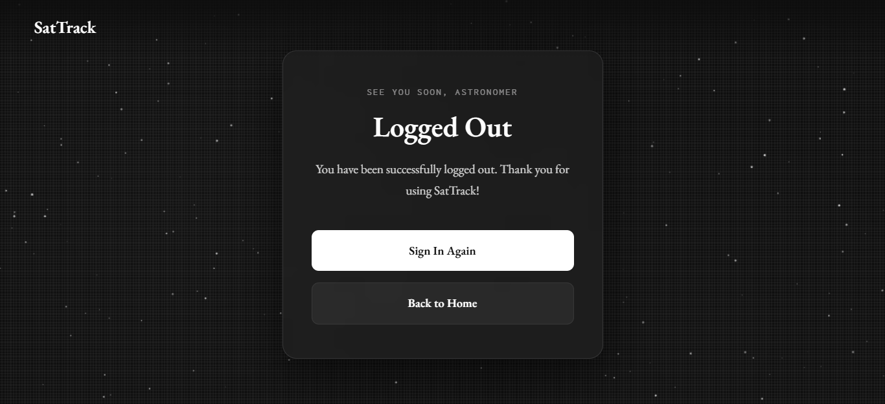
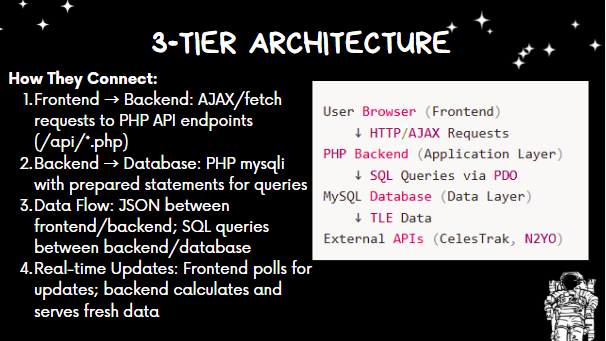

 <h1 align="center">SatTrack</h1>
 
 <p align="center">
   SatTrack is a lightweight full‑stack web app for tracking satellites above your sky, visualizing orbits in 3D, and sharing community observations. It combines accurate orbital data (TLE), server-side pass predictions, and a collaborative observations feed (likes, replies, nested comments).
   <br />
   <a href="#features"><strong>Explore the Features »</strong></a>
   <br /><br />
   
   
   
 </p>
 

 ## Features
 - Interactive 3D globe (Cesium) with satellite markers.
- Personal watchlist: add/remove satellites, share/import watchlists.
- Pass predictions tailored to your location (server-side propagation).
- Observations feed with: public posts, likes, nested replies/comments.
- Robust CSRF protection and session security
- Server-side geocoding using Nominatim (change location from UI).
- Responsive dashboard and helpful guide modal for new users. 
 
 
 ## Core Web Pages
 
 | Page | Description |
 |------|-------------|
 | **Landing / Home (`index.php`)** | Project landing and quick actions (intro, login/register, demo link).
 | **Dashboard (`dashboard.php`)** | User dashboard with the interactive globe, watchlist, upcoming passes, and observations feed.
 | **Login (`login.php`) / Register (`register.php`)** | User authentication and account creation.
 | **Observations (`observations.php`)** | Community feed to post observations, like, and reply (nested comments supported).
 | **Pass Predictions (`passes.php`)** | Server-side pass predictions personalized to user location and watchlist.
 | **Profile (`profile.php`)** | Manage account details, location, and watchlist import/export.
 | **Watchlist API (`api/add_watchlist.php`, `api/remove_watchlist.php`)** | AJAX endpoints to add/remove satellites from a personal watchlist.
 | **About (`about.php`) / Help (`help.php`)** | Project information, guides, and UI help.
 | **Developer/Test (`test.php`)** | Misc developer/testing utilities (not part of user-facing UI).
 
 ---
 
 ## Database Design - ERD Diagram
 <p align="center">
   
 </p>
 
 
 ## Tech Stack
 
 <p align="left">
   
 </p>
 
 | Technology | Purpose |
 |-------------|----------|
 | **HTML5 / CSS3 / Tailwind (CDN) / CesiumJS / satellite.js** | Frontend structure and design |
 | **Vanilla JS** | Client-side interactivity |
 | **PHP(mysqli)** | Backend logic and data handling |
 | **MySQL** | Database management (migrations in `migrations/` and `database/schema.sql`) |
 | **Git & GitHub** | Version control and collaboration |
 | **Other libs** | Three.js (visuals), Nominatim (geocoding), N2YO/CelesTrak for seeding |

 
## Preview

 <p align="center">
   
 </p>
 
 
 ### Dashboard
 <p align="center">
   
 </p>
  
 ### Logout
 <p align="center">
   
 </p>
 
 ## System Flow Diagram
 <p align="center">
   
 </p>


 ## Requirements

- PHP 8+, MySQL, and a local webserver (XAMPP/Apache recommended on Windows)
- Composer is not required for core app code but may be helpful for tooling

 ## Installation Guide
 
 1. **Clone the repository**
    ```bash
    git clone https://github.com/marzafiee/SatTrack.git
 
 2. Create a database and apply migrations (or import `database/schema.sql`).
   - Using MySQL CLI or phpMyAdmin: import `database/schema.sql` and then run migration SQL files in `migrations/` if needed.
 - Open phpMyAdmin
 - Create a new database (e.g., attendance_db)
 - Import the .sql file located in the /database folder
 
 3. Copy the example `.env` and set values (create `.env` in `sattrack/`):
    ```env
    DB_HOST=localhost
    DB_NAME=sattrack
    DB_USER=root
    DB_PASS=
    N2YO_API_KEY=
    CESIUM_TOKEN=
    ```

4. Seed satellite data (optional):
- Use `database/seed_satellites.php` if you want to import a sample dataset for development.

5. Run the project
 - Start your local server (e.g., XAMPP or WAMP)
- Visit http://localhost/sattrack/ (or your webserver's configured path)


## Database migrations & local changes

- Schema files: `database/schema.sql`
- Migrations directory: `migrations/` (contains SQL to add likes/comments, parent comment support, etc.)

Tip: For small changes or testing, use phpMyAdmin or `mysql` CLI:

```bash
mysql -u root -p sattrack < database/schema.sql
mysql -u root -p sattrack < migrations/add_parent_to_observation_comments.sql
```

## API endpoints (selected)

These are used by the front-end JavaScript and are located in `api/`:

- `api/get_tle_data.php` — fetch TLE for watchlist satellites
- `api/add_watchlist.php` — add satellite to watchlist
- `api/remove_watchlist.php` — remove from watchlist
- `api/update_location.php` — resolve location (Nominatim) and save lat/lng
- `api/add_observation.php` — create an observation (CSRF-protected)
- `api/add_comment.php` — add comment/reply to an observation (supports `parent_comment_id`)
- `api/get_comments.php` — get nested comments for an observation
- `api/toggle_like.php` — like/unlike an observation

All write endpoints require login and CSRF token (hidden `input[name="csrf"]` in forms). Successful AJAX actions return `csrf_new` to rotate tokens and avoid stale-token errors.


## Front-end behavior & UX notes

- Observations feed supports nested replies (unbounded depth) and in-place updates.
- The globe shows colored markers for satellites even if TLEs are temporarily missing (placeholder markers), and shows orbits when TLEs are available.
- Sidebar help button is pinned to the bottom of the watchlist regardless of length.


## Security notes

- Sessions use `HttpOnly`, `SameSite=Strict`, and `Secure` when HTTPS is present.
- CSRF tokens are stored server-side in `csrf_tokens` table; a session fallback is used if DB writes fail (to avoid "invalid CSRF token" issues during development).
- In production, serve over HTTPS and set secure cookie flags.

## Testing & Troubleshooting

- If you see "invalid csrf token" when submitting forms:
  - Ensure PHP sessions are working (session cookie present) and DB is reachable.
  - The system now falls back to session-stored tokens if DB insert fails.
  - After successful AJAX writes, the server returns `csrf_new` — the client updates the token automatically.

- If the globe is empty:
  - Confirm `api/get_tle_data.php` returns satellite data for your watchlist.
  - Placeholder markers are shown if TLEs are missing; orbits require valid TLEs.
 
 ## Contributors
 <p align="left"> <a href="https://github.com/Marzafiee">  </a> <br> <sub><b>marzafiee</b></sub> </p>
 
 ## Contributing

- Fork the repo, create a branch, and open a PR describing the change.
- Tests: manual UI/UX testing is used; aim to add regression checks for critical behaviors (CSRF, comment nesting, watchlist add/remove).
- If adding DB migrations, place them in `migrations/` and include `ALTER TABLE` statements for incremental updates.

 ## Credits
- Contributors: see repo blame/commits
- Libraries & services: CesiumJS, satellite.js, Three.js, OpenStreetMap/Nominatim, N2YO/CelesTrak APIs.

 ## License
 - Distributed under the MIT License.
 - See LICENSE for more information.
 
 ## Submission Links
 - **GitHub Repository**: [SatTrack Repo](https://github.com/marzafiee/SatTrack)
 - **View Live Site here**: [Demo SatTrack](http://sattrack.42web.io/)
 

